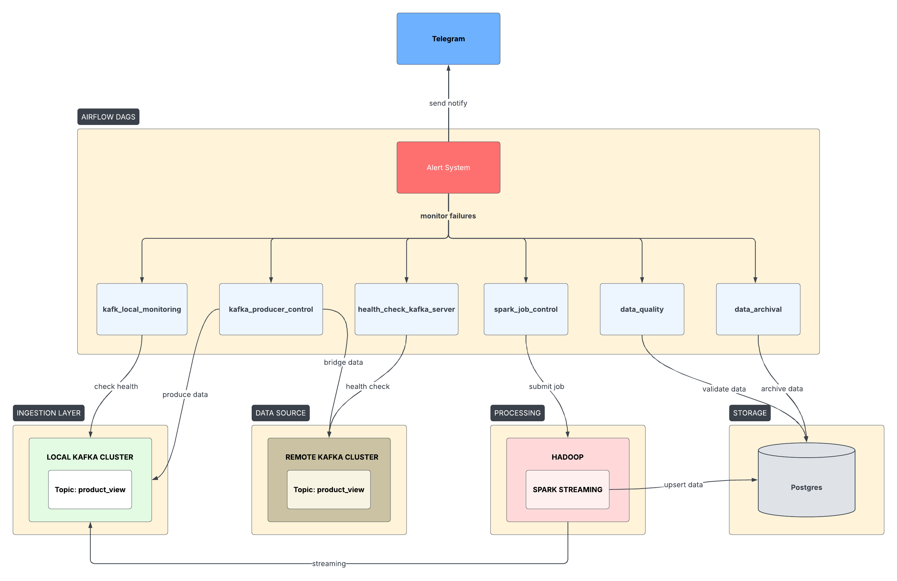
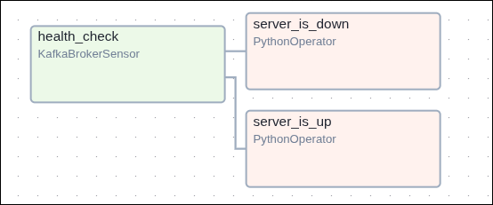

# Airflow Pipeline — Orchestration Layer

Airflow project that manages and monitors the entire real-time data pipeline:
**Kafka Producer → Spark Structured Streaming → PostgreSQL Star Schema**.

## Table of Contents

- [Project Flow Overview](#project-flow-overview)
- [Project Structure](#project-structure)
- [DAGs Overview](#dags-overview)
  - [Core DAGs](#core-dags)
  - [Monitoring & Quality DAGs](#monitoring--quality-dags)
  - [DAG: kafka_producer_control](#dag-kafka_producer_control)
  - [DAG: spark_job_control](#dag-spark_job_control)
  - [DAG: alert_system](#dag-alert_system)
  - [DAG: kafka_local_monitoring](#dag-kafka_local_monitoring)
  - [DAG: data_quality](#dag-data_quality)
  - [DAG: data_archival](#dag-data_archival)
  - [DAG: health_check_kafka_server](#dag-health_check_kafka_server)
- [Custom Plugins (Hooks)](#custom-plugins-hooks)
- [Setup](#setup)
  - [1. Create Docker network](#1-create-docker-network)
  - [2. Build custom Airflow image](#2-build-custom-airflow-image)
  - [3. Initialize the environment](#3-initialize-the-environment)
  - [4. Initialize Airflow config](#4-initialize-airflow-config)
  - [5. Initialize the database](#5-initialize-the-database)
  - [6. Start Airflow](#6-start-airflow)
- [Airflow Services](#airflow-services)
- [Web Interface](#web-interface)
- [Testing](#testing)
- [References](#references)

## Project Flow Overview



## Project Structure

```
airflow/
├── dags/                                  # DAG definitions
│   ├── kafka_producer_control_dag.py      # Manages Kafka producer (Remote → Local)
│   ├── spark_job_control_dag.py           # Manages Spark Structured Streaming job
│   ├── kafka_local_monitoring.py          # Monitors local Kafka health & data flow
│   ├── data_quality_dag.py                # Comprehensive data quality checks
│   ├── data_archival_dag.py               # Data lifecycle & storage optimization
│   ├── alert_system_dag.py                # Centralized alerting framework
│   └── health_check_kafka_server.py       # Remote Kafka connectivity check
│
├── plugins/                               # Custom Airflow plugins
│   ├── hooks/
│   │   ├── kafka_hook.py                  # Kafka monitoring hook
│   │   └── postgres_hook_ext.py           # Extended PostgreSQL hook
│   ├── operators/
│   │   ├── data_quality.py                # Custom data quality operators
│   │   ├── data_archival.py               # Custom archival and maintenance operators
│   │   └── spark_job.py                   # Spark job submission operators
│   └── sensors/
│       ├── kafka_sensor.py                # Custom Kafka broker availability sensor
│       └── hadoop_sensor.py               # Custom Hadoop cluster (HDFS + YARN) sensor
│
├── tests/                                 # Test suite
│   ├── conftest.py                        # Pytest fixtures
│   ├── test_dag_validation.py             # DAG structure tests
│   ├── test_hooks.py                      # Hook unit tests
│   └── test_operators.py                  # Custom operator unit tests
│
├── images/                                # Architecture & flow diagrams
├── config/                                # Airflow configuration mounts
├── docker-compose.yaml                    # Airflow cluster (CeleryExecutor)
├── Dockerfile                             # Custom Airflow image (+ OpenJDK-17)
├── pyproject.toml                         # Project metadata & dependencies (uv)
├── uv.lock                                # Locked dependencies
├── requirements.txt                       # Legacy dependency export
└── .env                                   # AIRFLOW_UID, DOCKER_GID
```

## DAGs Overview

### Core DAGs

| DAG                      | Schedule | Description                                                                            |
| ------------------------ | -------- | -------------------------------------------------------------------------------------- |
| `kafka_producer_control` | `@daily` | Runs the Kafka producer inside a Docker container, forwarding data from Server → Local |
| `spark_job_control`      | `@daily` | Submits the Spark Structured Streaming job to YARN via Docker                          |

### Monitoring & Quality DAGs

| DAG                         | Schedule         | Description                                                       |
| --------------------------- | ---------------- | ----------------------------------------------------------------- |
| `kafka_local_monitoring`    | `*/2 * * * *`    | Monitors local Kafka cluster health, throughput, and consumer lag |
| `data_quality`              | `*/15 * * * *`   | Runs comprehensive data quality checks                            |
| `data_archival`             | Weekly (Sun 2AM) | Manages data retention & storage optimization                     |
| `alert_system`              | `*/10 * * * *`   | Centralized alerting with Telegram notifications                  |
| `health_check_kafka_server` | `*/5 * * * *`    | Connectivity check for remote Kafka server (via UI Variables)     |

### DAG: `kafka_producer_control`

**Tasks Details:**

1. **`run_kafka_producer`**
   - Executes the Kafka producer script (`src/kafka/producer.py`) inside a isolated Docker
     container. It installs necessary dependencies (`confluent-kafka`, `python-dotenv`) at runtime and forwards data
     from
     the remote server to the local cluster.
   - Forwards data from the remote Kafka Server to the local Kafka cluster

### DAG: `spark_job_control`


**Tasks Details:**

1. **`wait_for_kafka`** — `KafkaBrokerSensor` in `reschedule` mode: waits up to 10 minutes for at least one Kafka broker to become reachable, freeing the worker slot between pokes (every 60 s)
2. **`wait_for_hadoop`** — `HadoopClusterSensor` in `reschedule` mode: verifies both the HDFS NameNode (port 8020) and YARN ResourceManager (port 8088) are reachable before allowing Spark submission
3. **`check_postgres`** — Runs a simple `SELECT 1` against the PostgreSQL Data Warehouse to ensure connectivity
4. **`submit_spark_streaming_job`** — Submits the Spark job via `SparkStreamingOperator` (extends `DockerOperator`):
   - Image: `unigap/spark:3.5`
   - Sets up conda environment → `conda pack` → `spark-submit` to YARN
   - Mounts project source, Spark lib cache, and data volumes
5. **`post_job_status`** — Checks the fact table row count in PostgreSQL
6. **`cleanup_resources`** — Removes leftover Docker containers (trigger_rule: `all_done`)

**Flow:** `[wait_for_kafka, wait_for_hadoop]` (parallel) → `check_postgres` → `submit_spark_streaming_job` → `post_job_status` → `cleanup_resources`

### DAG: `alert_system`


**Tasks Details:**

1. **`evaluate_alert_rules`** — Iterates through predefined rules (Kafka health, table counts, data quality, DAG
   failures) and identifies triggered alerts.
2. **`classify_and_prioritize`** — Groups triggered alerts by severity (CRITICAL to LOW) and determines if emergency
   escalation is required.
3. **`send_notifications`** — Formats the alert report and sends it via the Telegram Bot API using credentials from
   Airflow Variables.

**Alert Rules:**

| Rule                   | Severity | Check Type       | Description                                                         |
| ---------------------- | -------- | ---------------- | ------------------------------------------------------------------- |
| `kafka_broker_down`    | CRITICAL | `kafka_health`   | Pings Kafka broker via TCP socket to verify reachability            |
| `fact_table_empty`     | HIGH     | `table_check`    | Queries `fact_product_views` to ensure it contains data             |
| `low_data_quality`     | MEDIUM   | `data_quality`   | Checks for duplicate `fact_id` records in the fact table            |
| `high_storage_usage`   | LOW      | `storage_check`  | Placeholder for monitoring unusual database storage growth          |
| `dag_failure_detected` | CRITICAL | `dag_failure`    | Queries Airflow metadata DB for DAGs that failed in the last 15 min |
| `data_stagnation`      | HIGH     | `data_freshness` | Checks if Spark streaming is still pushing data (freshness check)   |

**Telegram Notifications:**

Alerts are sent as formatted HTML messages to a Telegram chat via the Bot API. Messages include severity emoji
indicators for alert descriptions, and timestamps

- 🔴 CRITICAL
- 🟠 HIGH
- 🟡 MEDIUM
- 🔵 LOW

**Required Airflow Variables** (set via Admin → Variables in the Airflow UI):

| Variable                   | Description                          | How to obtain                     |
| -------------------------- | ------------------------------------ | --------------------------------- |
| `SERVER_BOOTSTRAP_SERVERS` | Remote Kafka Bootstrap (IP:Port,...) | From Infrastructure Admin         |
| `TELEGRAM_BOT_TOKEN`       | Bot API token from @BotFather        | Telegram → @BotFather → `/newbot` |
| `TELEGRAM_CHAT_ID`         | Target chat ID for notifications     | Telegram → @GetsMyIDBot           |
| `project_path`             | Absolute path to project on host     | Run `pwd` in the project root     |
| `kafka_target_topic`       | Default local Kafka topic            | e.g., `product_view`              |

**Required Airflow Connections** (set via Admin → Connections in the Airflow UI):

| Conn Id              | Conn Type | Host / JSON / Extra Details                                     | Description                             |
| -------------------- | --------- | --------------------------------------------------------------- | --------------------------------------- |
| `postgres_streaming` | Postgres  | Host: `172.18.0.1` (or local IP), DB: `spark_streaming_schema`  | Connects to PostgreSQL Data Warehouse   |
| `local_kafka_conn`   | Kafka     | Host: `kafka-0:9092,kafka-1:9092...`, Extra: `{"topic": "..."}` | Connects Airflow sensors to local Kafka |
| `kafka_default`      | Kafka     | Host: Remote bootstrap servers, Extra: SASL configurations      | Connects to the upstream Kafka server   |

### DAG: `kafka_local_monitoring`


**Tasks Details:**

1. **`check_local_broker_health`** — Uses `KafkaMonitoringHook` to ping the local broker and measure connectivity.
2. **`check_local_data_flow`** — Estimates message throughput and monitors consumer group lag for the ingestion layer.
3. **`branch_on_health`** — `BranchPythonOperator` that routes the flow based on broker reachability.
4. **`local_broker_healthy`** — Execution path when the cluster is operating normally.
5. **`local_broker_unhealthy`** — Execution path when a broker failure is detected (triggers alerts via the `alert_system`).
6. **`generate_local_monitoring_report`** — Consolidates health metrics and throughput data into a comprehensive JSON report for logging and observability.

### DAG: `data_quality`


**Tasks Details:**

1. **`check_completeness`** — Verifies row counts and data presence across the entire star schema.
2. **`check_data_types`** — Validates column data types against expected schema definitions.
3. **`check_business_rules`** — Runs SQL checks for referential integrity (no orphans) and unique constraints (no
   duplicates).
4. **`monitor_error_rates`** — Tracks total record counts to identify potential data loss or anomalies.
5. **`generate_quality_report`** — Summarizes all quality metrics into a central status report (HEALTHY/DEGRADED).

### DAG: `data_archival`


**Tasks Details:**

1. **`check_archival_candidates`** — Identifies records older than the **30-day** retention threshold.
2. **`branch_archival`** — Routes the flow based on whether archival candidates exist.
3. **`skip_archival`** — Execution path when no records qualify for archival.
4. **`archive_old_records`** — Moves expired records from the fact table to an archival destination.
5. **`cleanup_staging`** — Cleans up staging tables and temporary data.
6. **`check_storage_sizes`** — Monitors disk space usage for all star schema tables.
7. **`optimize_database`** — Runs `VACUUM ANALYZE` to reclaim storage and update statistics.
8. **`generate_archival_report`** — Consolidates the archival results and storage sizes into a report.

### DAG: `health_check_kafka_server`



**Tasks Details:**

1. **`health_check`** — `KafkaBrokerSensor` in `poke` mode: checks TCP connectivity to the remote Kafka brokers defined in the `SERVER_BOOTSTRAP_SERVERS` Airflow Variable. Pokes every 30 s with a 1-minute timeout.
2. **`server_is_up`** — Runs when `health_check` succeeds (default `trigger_rule: all_success`). Logs a success message.
3. **`server_is_down`** — Runs when `health_check` fails (`trigger_rule: one_failed`). Logs a warning and raises an exception to mark the DAG as FAILED for alerting.

> **Note:** Routing is handled via Airflow's `trigger_rule` mechanism instead of `BranchPythonOperator`, ensuring the DAG correctly reflects a FAILED state when the cluster is down.

## Custom Plugins

### Hooks

| Hook                   | Description                                                     |
| ---------------------- | --------------------------------------------------------------- |
| `KafkaMonitoringHook`  | Checks broker connectivity, cluster health, and response time   |
| `PostgresExtendedHook` | Extended hook: fact table count, data quality, archival, VACUUM |

### Operators

| Operator                   | Description                                                                                                          |
| -------------------------- | -------------------------------------------------------------------------------------------------------------------- |
| `SparkStreamingOperator`   | Wraps `DockerOperator` to submit Spark-on-YARN jobs with pre-configured mounts, env vars, and `spark-submit` command |
| `DataQualityOperator`      | Runs a list of SQL checks against PostgreSQL; fails the task if any check returns an unexpected result               |
| `PostgresArchivalOperator` | Archives records older than a configurable retention threshold from the fact table                                   |

### Sensors

| Sensor                | Description                                                                                                       |
| --------------------- | ----------------------------------------------------------------------------------------------------------------- |
| `KafkaBrokerSensor`   | Waits for at least one Kafka broker to be reachable via TCP; supports multi-broker failover and `reschedule` mode |
| `HadoopClusterSensor` | Waits for HDFS NameNode and YARN ResourceManager to be reachable before Spark job submission                      |

## Setup

### 1. Create Docker network

```bash
docker network create streaming-network --driver bridge
```

### 2. Build custom Airflow image

The image includes OpenJDK-17 (required by the Spark provider) and all Python dependencies managed by `uv`.

```bash
cd airflow
docker build -t unigap/airflow:2.10.4 .
```

### 3. Initialize the environment

**Create required directories:**

```bash
mkdir -p ./dags ./logs ./plugins ./config
```

**Get user ID and Docker group ID:**

```bash
id -u                    # → AIRFLOW_UID
getent group docker      # → DOCKER_GID
```

**Update `.env`:**

```env
AIRFLOW_UID=1000
DOCKER_GID=999
AIRFLOW_IMAGE_NAME=unigap/airflow:2.10.4
```

### 4. Initialize Airflow config

```bash
docker compose run airflow-cli bash -c "airflow config list > /opt/airflow/config/airflow.cfg"
```

### 5. Initialize the database

```bash
docker compose up airflow-init
```

### 6. Start Airflow

```bash
docker compose up -d
```

**Check status:**

```bash
docker compose ps
```

## Airflow Services

| Service             | Description                                               |
| ------------------- | --------------------------------------------------------- |
| `airflow-webserver` | Web interface available at http://localhost:18080         |
| `airflow-scheduler` | Monitors all tasks & DAGs, triggers task instances        |
| `airflow-worker`    | Executes tasks assigned by the scheduler (CeleryExecutor) |
| `airflow-triggerer` | Runs an event loop for deferrable tasks                   |
| `airflow-init`      | Initialization service (creates DB, admin user)           |
| `postgres`          | Database backend for Airflow metadata                     |
| `redis`             | Message broker for Celery (scheduler → worker)            |

## Web Interface

- **URL**: http://localhost:18080
- **Username**: `airflow`
- **Password**: `airflow`

## Testing

This project uses `uv` for lightning-fast dependency management and testing.

```bash
# Run all tests using uv
cd airflow
uv run pytest tests/ -v

# Run specific test categories
uv run pytest tests/test_dag_validation.py -v    # DAG structure
uv run pytest tests/test_hooks.py -v              # Hooks
```

## References

- [Running Airflow in Docker](https://airflow.apache.org/docs/apache-airflow/stable/howto/docker-compose/index.html)
- [DockerOperator](https://airflow.apache.org/docs/apache-airflow-providers-docker/stable/operators.html)
- [CeleryExecutor](https://airflow.apache.org/docs/apache-airflow/stable/core-concepts/executor/celery.html)
- [uv: Python packaging in Rust](https://github.com/astral-sh/uv)
